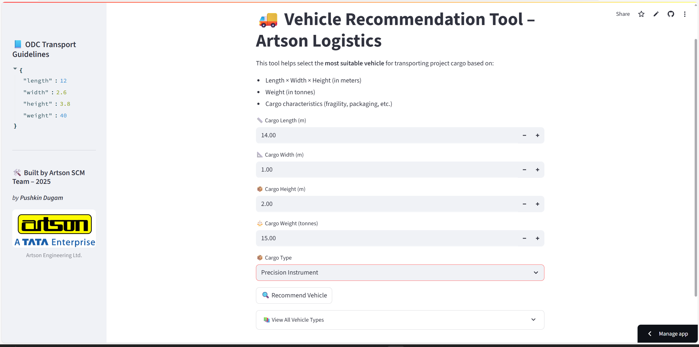
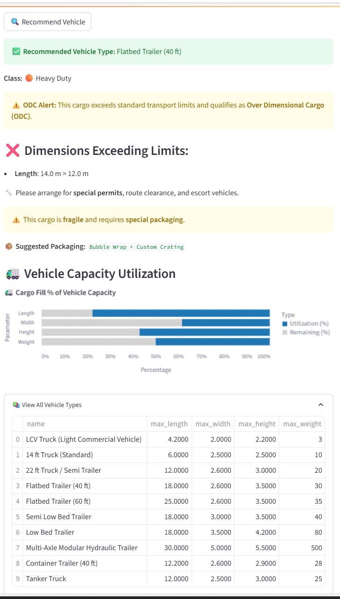

# 🚛 Artson Vehicle Selector – EPC Transport Planner

An intelligent transport logistics assistant for **Artson Engineering Ltd.**, built to assist EPC project teams in selecting the **right vehicle** for cargo transport.

🔗 **Live App:**  
👉 [https://artson-vehicle-selector-xewufqpfkn32dzkeqlguk5.streamlit.app/](https://artson-vehicle-selector-xewufqpfkn32dzkeqlguk5.streamlit.app/)

---

## 📦 What This Tool Does

This Streamlit-powered tool allows **project engineers**, **site planners**, and **SCM professionals** to:

- Enter **cargo dimensions (Length × Width × Height)** and **weight**
- Instantly get a **vehicle recommendation** from real EPC transport options
- Check if the cargo qualifies as **ODC (Over Dimensional Cargo)** under CMVR
- Get **packaging suggestions** for fragile cargo types
- Visualize **vehicle capacity utilization**

---

## 🛠️ Features

| Feature                          | Description                                                                 |
|----------------------------------|-----------------------------------------------------------------------------|
| 📐 Dimension & weight input       | Easy-to-use interface in meters and tonnes                                  |
| ⚙️ Intelligent vehicle selection | Chooses from real-world vehicles (LCV, 14-ft, 22-ft, 40-ft, LBT, MAHT, etc.)|
| 🚨 ODC alert                      | Flags cargo that exceeds CMVR limits and advises on permits/escorts         |
| 🧊 Fragile cargo packaging        | Suggests protective packaging (Bubble wrap, Wooden crate, etc.)             |
| 📊 Capacity utilization chart     | Bar chart showing % fill of recommended vehicle                             |
| 📋 Expandable vehicle reference  | View full table of all supported vehicle types                              |
| 🌐 Streamlit UI                   | Deployed online; works instantly without login                              |

---

## 📸 Screenshots

### 🔧 Input Interface  

### 📦 Output Recommendations  

---

