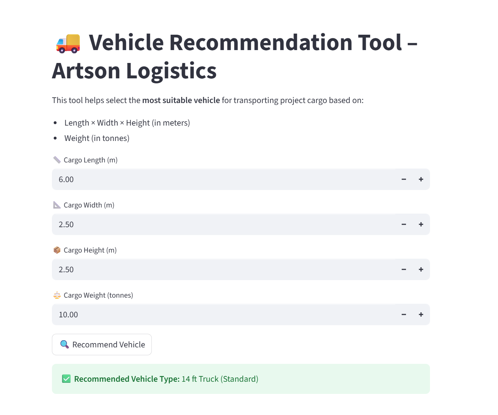

# 🚛 Artson Vehicle Selector – EPC Transport Planner

A logistics decision support tool built for **Artson Engineering Ltd.**, this app recommends the **most suitable vehicle type** for transporting project cargo based on its size and weight.

🔗 **Live App:**  
👉 [https://artson-vehicle-selector-xewufqpfkn32dzkeqlguk5.streamlit.app/](https://artson-vehicle-selector-xewufqpfkn32dzkeqlguk5.streamlit.app/)

---

## 📦 What This Tool Does

This Streamlit-based tool lets EPC project engineers, site planners, and SCM teams:

- Input **cargo dimensions (L×W×H)** and **weight**
- Instantly see the best vehicle recommendation from a curated list of trailers and trucks
- Identify if cargo is **ODC (Over Dimensional)** and requires **special planning**

---

## 🛠️ Features

| Feature                          | Description                                                                 |
|----------------------------------|-----------------------------------------------------------------------------|
| 📐 Dimension & weight input       | User-friendly number inputs in meters and tonnes                            |
| ⚙️ Intelligent vehicle selection | Matches to real-world truck/trailer specs (LCV, 22-ft, 40-ft, LBT, MAHT...) |
| 🚨 ODC alert                      | Auto-fails and flags if no standard vehicle can carry the cargo             |
| 🌐 Streamlit Web Interface        | Clean, responsive UI accessible via link – no login required                |

---

## 📸 Screenshot




---

## 🧠 How It Works

The app uses a Python-based rules engine with a vehicle reference table like:

- **LCV Truck (3T)** — 4.2m long
- **14-ft Truck (10T)** — 6m
- **Flatbed Trailer (40 ft)** — 18m, 30T
- **Low Bed Trailer (LBT)** — 3.5m wide, 80T
- **Hydraulic Modular Trailer** — up to 500T

It selects the **first matching vehicle** that can safely carry the input cargo.

---

## 🚀 Run Locally

```bash
git clone https://github.com/yourusername/artson-vehicle-selector.git
cd artson-vehicle-selector
pip install streamlit
streamlit run vehicle_selector_app.py

